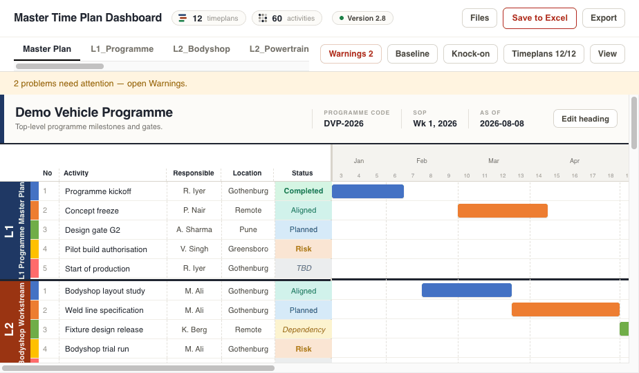
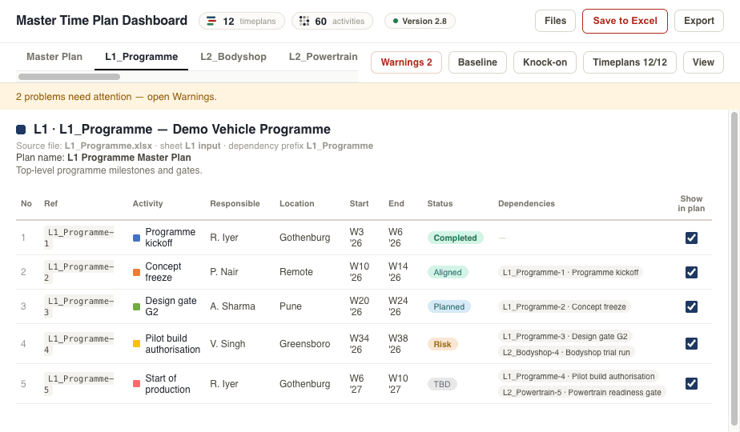
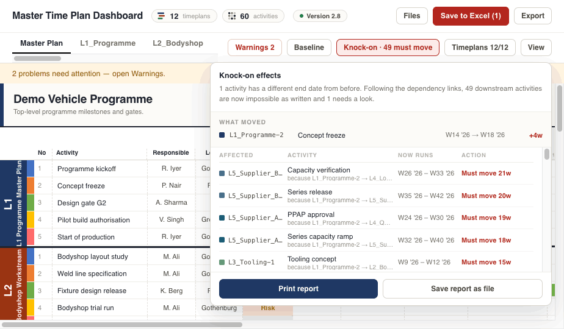

# Master Time Plan Dashboard

**Twelve people keep their own Excel timeplan. This reads all of them and draws one plan.**

An offline HTML dashboard that reads one Excel file per timeplan out of a shared folder and
stacks them into a single master Gantt — L1 at the top, L5 at the bottom. It writes changes
back into the original workbooks, keeps a dated copy of every version it replaces, and tells
you what has to move when something slips.

No install, no server, no account, no internet. One HTML file.



---

## Why

Programme plans get split across levels and owners: a programme master plan, a plan per
workstream, a plan per supplier. Each owner works in their own Excel file, which is right —
they own their dates. What nobody has is the whole picture, and by the time it is copied into
one deck by hand it is a week old and wrong.

This dashboard leaves every owner's file exactly where it is. It reads them all, draws them
together, and reports the four things that are hard to see across separate files:

- what is stale (nobody has touched L4_Logistics for 49 days)
- what is broken (a dependency pointing at an activity that does not exist)
- what has moved since the last review
- what else has to move because of it

## Quick start

1. Download the folder, or clone this repository.
2. Open `05_Master_Time_Plan_Dashboard/Time Plan Dashboard.html` in Chrome or Edge.
3. Press **Load folder** and pick `03_Time_Plans`.

Twelve example timeplans are included, so it draws something straight away. Delete them when
you start your own.

## What is in the box

```
README.md                      this file
01_Documentation/              README-AI.md — the technical reference for the whole app
02_Templates/                  blank L1–L5 starter files — copy one to create a new timeplan
03_Time_Plans/                 the live timeplans, one .xlsx per plan — this is what you load
04_Exports/                    somewhere to put SVG / PNG / PDF exports
05_Master_Time_Plan_Dashboard/ the dashboard itself — open this
```

Two folders appear inside `03_Time_Plans` as you use it: `_baselines/` (dated snapshots for the
Baseline view) and `04_Archived_Timeplans/` (the version each file replaced, dated). Nothing in
the code hardcodes any of these names — rename them freely.

## One file per timeplan

Copy the matching file out of `02_Templates` into `03_Time_Plans` and rename it:
`L3_TEMPLATE.xlsx` → `L3_Tooling.xlsx`. Don't rename the sheets inside.

**The file name sets the level and the order.** `L1` … `L5` puts the plan in the stack (L1 on
top); the word after it orders plans that share a level. Several files may share a level.

Each file has exactly two sheets: **`L3 input`** (where the owner types — the only sheet the
dashboard reads or writes) and **`L3 time plan`** (that plan's own Gantt in Excel, drawn by
formulas — don't type in it).

On the input sheet fill in the header block (Project Name, Code, SoP, Description, Timeplan
Name, **Plan ID**, **Last updated**) and then the activity table from row 7: Colour · No. ·
Activity / Event · Responsible · Location · Start Wk/Yr · End Wk/Yr · Tracker · Status ·
Comments · Dependencies.

**Plan ID** is set once and never changed — dependencies keep working even if the file is
renamed. **Last updated** is the freshness stamp; the dashboard flags plans older than two
weeks and stamps it for you when it saves.

<!-- Drop a screenshot of one of the Excel input sheets in docs/excel-input.png and uncomment:

-->

## Dependencies

In the Dependencies column write the **file name**, a hyphen, then the **No.** of the activity
this one waits for:

```
L1_Programme-14; L3_Tooling-7
```

Separate several with `;`. The activity name works instead of the No.
(`L1_Programme-Gate 2 review`), and a bare No. or name means "in this same file".

Use the No. — it is matched first and can never be ambiguous. Every activity's exact reference
is printed in the **Ref** column of its own tab, ready to copy. Anything that doesn't match is
listed under Warnings and drawn as a red chip; a typo is never silently dropped.



## What it does

| | |
|---|---|
| **Files** | Source folder, reload after an owner updates their file, change folder, clear. |
| **Save to Excel (n)** | Lists exactly which timeplans changed and what changed in each, then writes them. Only changed files are rewritten. |
| **Export** | SVG, PNG and PDF of the current view, plus printable A4 status sheets — one page per timeplan, with a sign-off line. |
| **Warnings** | Everything wrong in the loaded files. Filter by *Problems* / *To look at*, or by one timeplan. Green when clean. |
| **Baseline** | Freeze today's dates, then see what has moved since. |
| **Knock-on** | What else has to move because something moved. |
| **Timeplans n/m** | One row per file: show/hide, rename, **Age** (days since the owner last saved it), **Acts** (activity count), and that file's warning count. |
| **View** | Compact timeline, which columns to show, and a snapshot window that crops the view and every export. |

Double-click any bar or table row to change its start/end week and, optionally, its status,
name, responsible or location. Pending changes show in red until you save.

### Baselines

**Capture** freezes the start and end week of every activity in every loaded file, exactly as
they are at that moment, and stores it as a dated snapshot. Nothing on the plan moves and
nothing is written into the timeplans.

Afterwards, switching **Baseline view** on shows the difference: a dashed outline where the
activity used to sit and a badge for how far it moved — `+3w` (red) is three weeks later, `−2w`
(green) is two weeks earlier. Every snapshot is kept and named by month, and the two dropdowns
set what is compared: from a capture, to today's live plan or to a second capture. So "what
moved between the June and the August review" is one question, not an afternoon.

Activities are matched on Plan ID first, file name second, then activity number, so renaming a
file or an activity does not break the comparison.

### Knock-on effects

"If this slipped, what else has to move?" It looks at every activity whose end date differs
from before — an unsaved edit of yours, or a move away from the selected baseline — then
follows the Dependencies column downstream:

- **Must move Nw** — that activity now starts on or before the thing it waits for finishes. Its
  dates are impossible as they stand.
- **Review — only Nw float left** — it still fits, but with two weeks of slack or less.

**Print report** / **Save report as file** produce a two-part document: what changed, and what
that affects, with the owner of each affected activity. Take it to the review.

Nothing is changed automatically. The dashboard follows only the links people actually wrote
down.



## Saving, and how your old versions are kept

**Save to Excel** writes one file per changed timeplan, rebuilt from that file's own bytes, so
an edit in `L2_Bodyshop` can never touch `L1_Programme`. Formulas, conditional formatting,
colours and sheet protection all survive.

Before anything is overwritten, the version being replaced is copied into
`03_Time_Plans/04_Archived_Timeplans/` as `2026-08-08_1432_L2_Bodyshop.xlsx` — date, time, then
the timeplan file name, so the copies sort oldest to newest. Only then is the new version
written. If the copy cannot be made, the save stops and the original is left alone.

The checkbox in the Save panel turns archiving off if you don't want the copies; **Archive
elsewhere…** points them at any other folder.

Every rebuilt file is re-parsed and verified before anything is written; if one value doesn't
round-trip, the whole save aborts. If any file changed on disk since you loaded it, the save
stops and asks you to **Reload folder** first — you can't overwrite somebody else's work by
accident.

## Limits

- **Chrome or Edge** for folder loading and folder saving. Firefox and Safari can load files
  and will download saved files instead.
- The templates are formatted and formula-filled for about **200 activities per timeplan**. Go
  past that and the dashboard still works — it reads up to 2000 rows — but Warnings tells you
  to copy the last row of that file's own *time plan* sheet down, or its Excel Gantt stops
  drawing at row 200. Twelve files of 200 activities is 2400 activities and is fine.
- The grid draws up to 700 weeks (~13 years).

## Privacy

Nothing is uploaded anywhere. There is no server, no analytics, no network call of any kind.
All parsing, rendering and rebuilding happens in your browser, and the file works fully
offline — including from a USB stick or a network drive.

## For developers

`01_Documentation/README-AI.md` is the full technical reference: data model, the .xlsx parse
and rebuild path, dependency resolution, the baseline format, and every UI revision. The
dashboard is a single self-contained HTML file with no build step and no dependencies.
